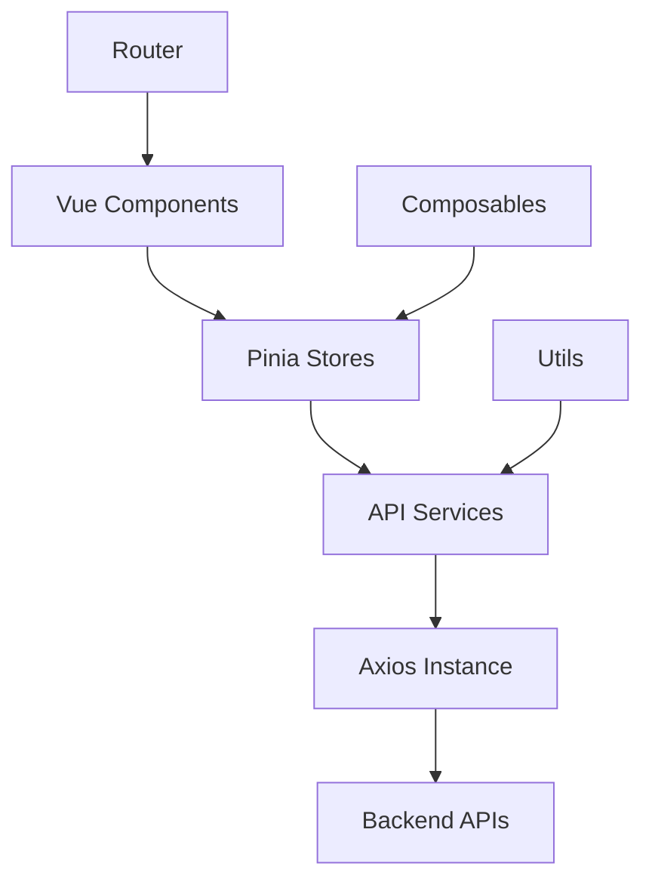
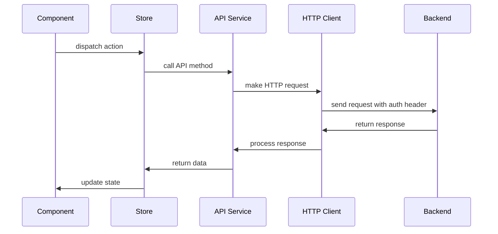
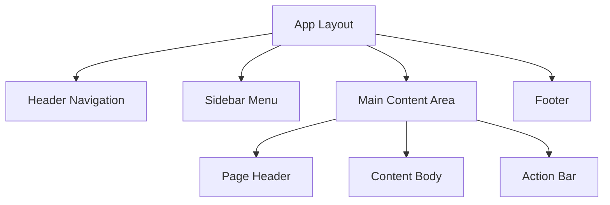
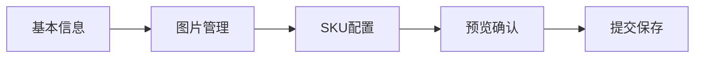

# 设计文档

## 概述

电商管理后台是一个基于Vue3+Vite构建的现代化单页应用，采用组合式API和TypeScript开发。系统提供完整的商品管理功能，包括商品、分类、SKU、规格等核心业务实体的CRUD操作。界面设计遵循现代化、简洁、年轻、充满活力的设计原则。

## 架构

### 技术栈
- **前端框架**: Vue 3 (Composition API)
- **构建工具**: Vite
- **开发语言**: TypeScript
- **UI组件库**: Element Plus
- **状态管理**: Pinia
- **路由管理**: Vue Router 4
- **HTTP客户端**: Axios
- **样式预处理**: SCSS

### 架构模式
采用分层架构模式：
- **表现层**: Vue组件、页面路由
- **业务逻辑层**: Pinia stores、组合式函数
- **数据访问层**: API服务、HTTP拦截器
- **工具层**: 工具函数、常量定义



## 组件和接口

### 核心组件结构

```
src/
├── components/           # 通用组件
│   ├── common/          # 基础组件
│   ├── layout/          # 布局组件
│   └── business/        # 业务组件
├── views/               # 页面组件
│   ├── auth/           # 认证相关页面
│   ├── product/        # 商品管理页面
│   ├── category/       # 分类管理页面
│   ├── spec/           # 规格管理页面
│   └── dashboard/      # 仪表板页面
├── stores/             # Pinia状态管理
├── api/                # API服务层
├── utils/              # 工具函数
├── composables/        # 组合式函数
├── types/              # TypeScript类型定义
└── router/             # 路由配置
```

### 主要接口定义

#### 认证接口
```typescript
interface AuthAPI {
  login(credentials: LoginRequest): Promise<LoginResponse>
}

interface LoginRequest {
  username: string
  password: string
}

interface LoginResponse {
  accessToken: string
  refreshToken: string | null
  tokenType: string
  expiresIn: number | null
  user: User
  authorities: string[]
}
```

#### HTTP服务接口
```typescript
interface HttpService {
  getAction<T>(url: string, params?: any): Promise<T>
  postAction<T>(url: string, data?: any): Promise<T>
  putAction<T>(url: string, data?: any): Promise<T>
  deleteAction<T>(url: string): Promise<T>
}
```

#### 业务实体接口
```typescript
interface Product {
  id?: number
  name: string
  description: string
  categoryId: number
  status: number
  createTime?: Date
  updateTime?: Date
  delFlag?: boolean
}

interface Category {
  id?: number
  name: string
  cateCode: string
  delFlag?: boolean
}

interface SKU {
  id?: number
  productId: number
  skuCode: string
  name: string
  price: number
  originalPrice: number
  stock: number
  warningStock: number
  isDefault: boolean
  delFlag?: boolean
}
```

## 数据模型

### 状态管理模型

#### 认证状态 (AuthStore)
```typescript
interface AuthState {
  accessToken: string | null
  user: User | null
  isAuthenticated: boolean
}

interface AuthActions {
  login(credentials: LoginRequest): Promise<void>
  logout(): void
  refreshToken(): Promise<void>
  updateToken(token: string): void
}
```

#### 商品状态 (ProductStore)
```typescript
interface ProductState {
  products: Product[]
  currentProduct: Product | null
  loading: boolean
  pagination: PaginationInfo
}

interface ProductActions {
  fetchProducts(params: QueryParams): Promise<void>
  createProduct(product: Product): Promise<void>
  updateProduct(product: Product): Promise<void>
  deleteProduct(id: number): Promise<void>
}
```

### 数据流模型



## HTTP请求架构

### Axios实例配置
```typescript
const apiClient = axios.create({
  baseURL: '/api',
  timeout: 10000,
  headers: {
    'Content-Type': 'application/json'
  }
})
```

### 请求拦截器
```typescript
apiClient.interceptors.request.use(
  (config) => {
    const token = getAccessToken()
    if (token) {
      config.headers.Authorization = `Bearer ${token}`
    }
    return config
  },
  (error) => Promise.reject(error)
)
```

### 响应拦截器
```typescript
apiClient.interceptors.response.use(
  (response) => {
    const newToken = response.headers['new-token']
    if (newToken) {
      updateAccessToken(newToken)
    }
    return response.data.result
  },
  (error) => {
    if (error.response?.status === 401) {
      handleUnauthorized()
    }
    return Promise.reject(error)
  }
)
```

### 封装的HTTP方法
```typescript
export const httpService: HttpService = {
  getAction: <T>(url: string, params?: any): Promise<T> => 
    apiClient.get(url, { params }),
  
  postAction: <T>(url: string, data?: any): Promise<T> => 
    apiClient.post(url, data),
  
  putAction: <T>(url: string, data?: any): Promise<T> => 
    apiClient.put(url, data),
  
  deleteAction: <T>(url: string): Promise<T> => 
    apiClient.delete(url)
}
```

## 用户界面设计

### 设计系统
- **主色调**: 现代蓝色系 (#409EFF)
- **辅助色**: 成功绿 (#67C23A)、警告橙 (#E6A23C)、危险红 (#F56C6C)
- **中性色**: 灰色系列用于文本和边框
- **字体**: 系统默认字体栈，确保跨平台一致性
- **圆角**: 4px基础圆角，8px卡片圆角
- **阴影**: 轻微阴影增强层次感

### 布局结构


### 响应式设计
- **桌面端**: >= 1200px，完整功能展示
- **平板端**: 768px - 1199px，侧边栏可折叠
- **移动端**: < 768px，抽屉式导航

### 主要页面设计

#### 商品管理页面
- **列表视图**: 表格展示，支持筛选、排序、分页
- **详情视图**: 抽屉或模态框展示详细信息
- **编辑视图**: 分步骤表单，包含基本信息、图片、SKU、规格

#### 综合商品添加页面
采用分步骤表单设计：
1. **基本信息步骤**: 商品名称、描述、分类选择
2. **图片管理步骤**: 多图片上传、排序、描述
3. **SKU配置步骤**: 规格选择、SKU生成、价格库存设置
4. **预览确认步骤**: 完整信息预览、最终提交



## 路由设计

### 路由结构
```typescript
const routes = [
  {
    path: '/login',
    component: LoginView,
    meta: { requiresAuth: false }
  },
  {
    path: '/',
    component: LayoutView,
    meta: { requiresAuth: true },
    children: [
      { path: 'dashboard', component: DashboardView },
      { path: 'products', component: ProductListView },
      { path: 'products/add', component: ProductAddView },
      { path: 'products/:id/edit', component: ProductEditView },
      { path: 'categories', component: CategoryListView },
      { path: 'specs', component: SpecManageView }
    ]
  }
]
```

### 路由守卫
```typescript
router.beforeEach((to, from, next) => {
  const authStore = useAuthStore()
  
  if (to.meta.requiresAuth && !authStore.isAuthenticated) {
    next('/login')
  } else {
    next()
  }
})
```

## 正确性属性

*属性是一个特征或行为，应该在系统的所有有效执行中保持为真——本质上是关于系统应该做什么的正式声明。属性作为人类可读规范和机器可验证正确性保证之间的桥梁。*

基于需求分析和属性反思，以下是系统的核心正确性属性：

### 属性 1: 认证令牌管理
*对于任何*有效的登录凭据，系统应该返回访问令牌并将其同时存储在Store和本地存储中，用户信息应存储在Store中
**验证需求: 需求 1.1, 1.2, 1.3**

### 属性 2: 自动令牌更新
*对于任何*包含new-token头的HTTP响应，系统应该自动用新令牌替换Store和本地存储中的现有令牌
**验证需求: 需求 1.5, 2.3**

### 属性 3: 认证重定向
*对于任何*需要认证的路由访问，当访问令牌不存在时，系统应该重定向到登录页面
**验证需求: 需求 1.4**

### 属性 4: HTTP请求认证头
*对于任何*HTTP请求，当访问令牌存在时，系统应该自动添加Authorization请求头
**验证需求: 需求 2.2**

### 属性 5: API响应数据解析
*对于任何*返回Result对象的API响应，系统应该正确提取并返回result属性中的数据
**验证需求: 需求 2.4**

### 属性 6: 实体CRUD操作一致性
*对于任何*业务实体（商品、分类、图片、SKU），创建、更新、删除操作应该正确修改对应的数据状态
**验证需求: 需求 3.2, 3.3, 3.4, 5.1, 5.2, 5.3, 6.1, 6.4**

### 属性 7: 分页查询一致性
*对于任何*支持分页的实体列表查询，系统应该根据pageNo和pageSize参数返回正确的分页数据
**验证需求: 需求 3.1, 5.4**

### 属性 8: 搜索过滤准确性
*对于任何*搜索查询条件，系统返回的结果应该只包含满足所有指定条件的记录
**验证需求: 需求 3.5, 5.5**

### 属性 9: 实体关联关系完整性
*对于任何*实体间的关联操作（规格键-规格值、商品-图片、SKU-规格），关联关系应该正确建立和维护
**验证需求: 需求 4.2, 6.1, 8.1, 8.2**

### 属性 10: 级联删除一致性
*对于任何*具有关联关系的实体删除操作，系统应该正确处理关联数据（检查约束或级联删除）
**验证需求: 需求 4.4, 8.3**

### 属性 11: SKU编码唯一性
*对于任何*新创建的SKU，系统应该生成全局唯一的SKU编码
**验证需求: 需求 7.1**

### 属性 12: 默认SKU唯一性约束
*对于任何*商品，系统应该确保最多只有一个SKU被标记为默认SKU
**验证需求: 需求 7.4**

### 属性 13: 规格组合唯一性验证
*对于任何*SKU的规格组合，在同一商品内应该保持唯一性
**验证需求: 需求 8.4**

### 属性 14: 表单验证实时性
*对于任何*表单输入，系统应该实时验证数据并提供即时反馈
**验证需求: 需求 9.2**

### 属性 15: 原子性数据保存
*对于任何*复合数据保存操作（如完整商品创建），所有相关数据应该原子性地保存或全部回滚
**验证需求: 需求 9.5**

### 属性 16: 图片格式验证
*对于任何*图片上传操作，系统应该验证文件格式和大小是否符合要求
**验证需求: 需求 6.2**

### 属性 17: 排序功能一致性
*对于任何*支持排序的实体（规格、图片），系统应该按照sortOrder字段正确排序显示
**验证需求: 需求 4.5, 6.3**

### 属性 18: 库存预警逻辑
*对于任何*设置了预警值的SKU，当库存低于预警值时，系统应该触发预警机制
**验证需求: 需求 7.3**

### 属性 19: 主题切换状态保持
*对于任何*主题切换操作，系统应该正确更新UI样式并保持主题状态
**验证需求: 需求 10.4**

## 错误处理

### 网络错误处理
- **连接超时**: 显示友好的超时提示，提供重试选项
- **网络中断**: 缓存用户操作，网络恢复后自动重试
- **服务器错误**: 根据HTTP状态码显示相应错误信息

### 认证错误处理
- **令牌过期**: 自动尝试刷新令牌，失败则重定向到登录页
- **权限不足**: 显示权限不足提示，禁用相关操作
- **登录失败**: 显示具体失败原因，支持重试

### 业务逻辑错误处理
- **数据验证失败**: 高亮错误字段，显示具体验证信息
- **关联约束冲突**: 提示用户处理关联数据后再操作
- **并发冲突**: 提示数据已被修改，提供刷新和重试选项

### 文件上传错误处理
- **格式不支持**: 提示支持的文件格式列表
- **文件过大**: 显示文件大小限制信息
- **上传失败**: 提供重新上传选项

## 测试策略

### 双重测试方法
系统采用单元测试和基于属性的测试相结合的方法：

**单元测试**:
- 验证特定示例和边界情况
- 测试组件集成点
- 验证错误条件处理
- 测试UI组件的渲染和交互

**基于属性的测试**:
- 验证跨所有输入的通用属性
- 通过随机化实现全面的输入覆盖
- 每个属性测试最少运行100次迭代
- 使用标签格式: **Feature: ecommerce-admin, Property {number}: {property_text}**

### 测试技术栈
- **测试框架**: Vitest (Vue3生态系统推荐)
- **组件测试**: Vue Test Utils
- **基于属性的测试**: fast-check (JavaScript生态系统)
- **模拟工具**: vi.mock() 用于API和外部依赖
- **测试覆盖率**: c8 (Vitest内置)

### 测试组织结构
```
tests/
├── unit/                    # 单元测试
│   ├── components/         # 组件测试
│   ├── stores/            # 状态管理测试
│   ├── api/               # API服务测试
│   └── utils/             # 工具函数测试
├── properties/             # 基于属性的测试
│   ├── auth.properties.test.ts
│   ├── crud.properties.test.ts
│   └── validation.properties.test.ts
├── integration/            # 集成测试
└── e2e/                   # 端到端测试
```

### 测试配置要求
- 每个正确性属性必须由单个基于属性的测试实现
- 每个属性测试必须引用其设计文档属性
- 最少100次迭代确保充分的随机化覆盖
- 测试应该专注于核心功能逻辑，避免过度测试边界情况
- 使用真实功能验证，避免使用模拟数据使测试通过

### 数据生成策略
- **智能生成器**: 为每个业务实体创建约束到有效输入空间的生成器
- **边界值测试**: 自动包含边界值和边界情况
- **关联数据生成**: 确保生成的测试数据维护实体间的关联关系
- **现实数据模式**: 生成器应该产生现实的业务数据模式